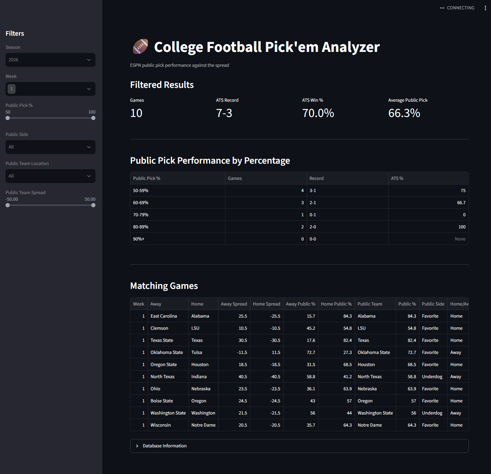

# CFB Pick'em Analyzer

A Python and Streamlit application for collecting and analyzing ESPN College Football Pick'em public selection data against the spread.

The project automates weekly data collection, stores historical results in SQLite, and provides an interactive dashboard for analyzing public-pick performance by percentage range, favorite/underdog status, home/away position, and spread.

## Dashboard



## Features

- Pulls ESPN College Football Pick'em data
- Extracts home and away teams
- Captures ATS spreads
- Captures ESPN public pick percentages
- Stores final scores
- Calculates ATS winners
- Tracks whether the public side won or lost ATS
- Stores historical data in SQLite
- Interactive Streamlit dashboard
- Filter by:
  - Season
  - Week
  - Public pick percentage
  - Favorite or underdog
  - Home or away team
  - Spread range

## Example Analysis

The application can answer questions such as:

- How have teams selected by 60–69% of the public performed ATS?
- How have public favorites performed?
- How have public underdogs performed?
- Do highly selected home favorites cover more often?
- How does ATS performance change by spread size?

## Architecture

```text
ESPN College Pick'em
        |
        v
    collect.py
        |
        v
   JSON Parsing
        |
        v
     SQLite
    pickem.db
        |
        v
     app.py
        |
        v
 Streamlit Dashboard